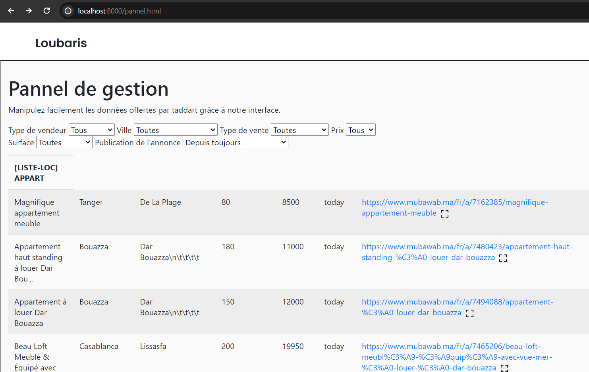
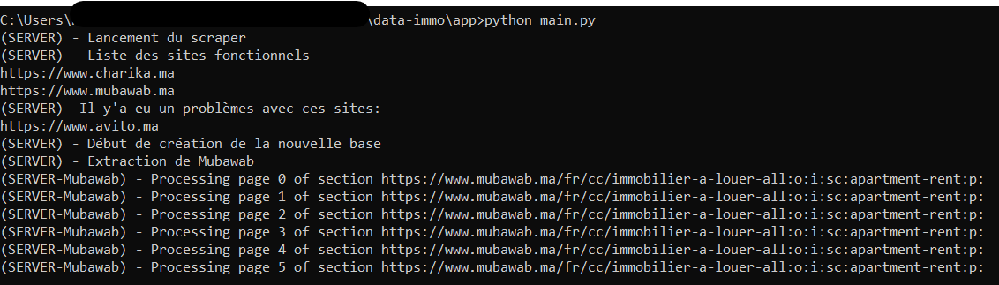
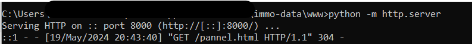

    <b>This project scrapes real estate listings from multiple property sale websites such as avito.ma, mubawab.ma, charika.ma and compiles them into various Excel databases of listings and directories. These data are then neatly displayed on a web panel for easy viewing and analysis. The project streamlines the process of collecting, organizing, and presenting real estate information.</b> 
     
    
      
  <b>Start app/main.py to start the scrapping process</b>  
     
    <b>The data is stored at /app/bases/xxxx.csv</b>  
    
      <b>Start the web pannel</b>  
    
  

